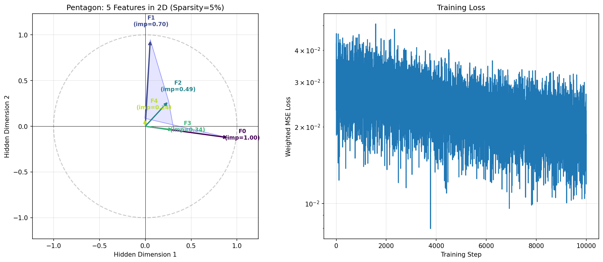
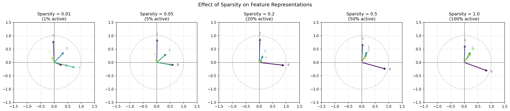
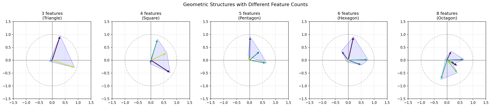
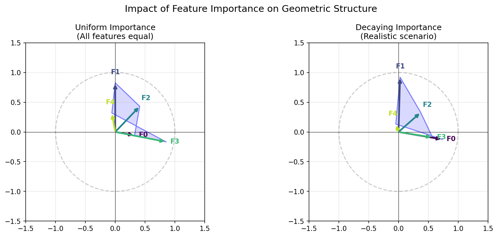

# Toy Model of Superposition

**Replicating Anthropic's foundational mechanistic interpretability experiment**

[](https://www.python.org/downloads/)
[](https://opensource.org/licenses/MIT)

## What is Superposition?

Neural networks can represent **more features than they have dimensions**. This seems impossible, since you can only have N orthogonal vectors in N-dimensional space. But when features are sparse (rarely active), networks learn to "cheat" by storing features as nearly-orthogonal vectors that interfere but rarely cause problems.

**The core insight**: With 5 sparse features and only 2 hidden dimensions, the optimal representation forms a **pentagon**. Each feature points to a vertex, maximizing the minimum angle between any two features.



## Why This Matters

This work builds on concepts introduced in the mechanistic interpretability literature:

1. **Real neural networks use superposition extensively**. This is why individual neurons are often "polysemantic" (respond to multiple unrelated concepts).

2. **Sparse Autoencoders (SAEs)** attempt to "undo" superposition to find interpretable features. Understanding superposition is prerequisite to understanding SAEs.

3. **This connects to OpenAI's sparse transformer research** and the broader effort to make neural networks interpretable.

## The Experiment

I train a simple linear autoencoder:

```
Input (5D) → Encoder (W) → Hidden (2D) → Decoder (W^T) → Output (5D)
```

With sparse inputs (each feature active ~5% of the time), the weight matrix W learns to represent all 5 features in 2D by arranging them as a pentagon.

## Key Results

### 1. Sparsity Enables Superposition



- **High sparsity (1% active)**: All 5 features get distinct representations
- **Low sparsity (50% active)**: Model can only represent the top 2 features
- **Dense (100% active)**: Pure dimensionality reduction, only 2 features survive

### 2. Different Feature Counts → Different Geometries



- 3 features in 2D → Triangle
- 4 features in 2D → Square
- 5 features in 2D → Pentagon
- 6 features in 2D → Hexagon
- 8 features in 2D → Octagon

### 3. Feature Importance Affects Allocation



When features have different importance weights, the model allocates more capacity to important features, distorting the perfect geometric structure.

## Installation

```bash
git clone https://github.com/designer-coderajay/toy-model-superposition.git
cd toy-model-superposition
pip install numpy matplotlib
```

## Usage

```python
from toy_superposition import ToyModelSuperposition, visualize_superposition

# Create and train model
model = ToyModelSuperposition(n_features=5, n_hidden=2)
model.train(sparsity=0.05, n_steps=10000)

# Visualize learned representations
fig = visualize_superposition(model)
fig.savefig('my_pentagon.png')

# Analyze geometry
analysis = model.analyze_geometry()
print(f"Angle gaps: {analysis['angle_gaps']}")
print(f"Ideal gap for pentagon: {analysis['ideal_gap']}°")
```

## Run All Experiments

```bash
python toy_superposition.py
```

This generates:

- `pentagon_visualization.png` - Main pentagon formation
- `importance_comparison.png` - Uniform vs decaying importance
- `sparsity_comparison.png` - Effect of sparsity
- `geometric_shapes.png` - Triangle through octagon

## Technical Details

### Loss Function

Weighted MSE where each feature has an importance weight:

```
L = Σᵢ importance[i] × (x[i] - x̂[i])²
```

Default importance decays exponentially: `importance[i] = 0.7^i`

### Key Parameters

| Parameter          | Default | Description                              |
| ------------------ | ------- | ---------------------------------------- |
| `n_features`       | 5       | Number of input features                 |
| `n_hidden`         | 2       | Bottleneck dimension                     |
| `importance_decay` | 0.7     | Exponential decay for feature importance |
| `sparsity`         | 0.05    | Probability each feature is active       |

### Analytical Gradients

The model computes gradients analytically for efficiency. The tied-weight autoencoder gradient involves contributions from both encoder and decoder paths:

```python
grad = grad_from_decode + grad_from_encode
```

Both are verified against numerical gradients (see `test_superposition.py`).

## Project Structure

```
toy-model-superposition/
├── toy_superposition.py    # Main implementation
├── test_superposition.py   # Comprehensive test suite
├── README.md               # This file
└── *.png                   # Generated visualizations
```

## Connection to Research

This replicates the core experiment from:

**"Toy Models of Superposition"** - Elhage et al., Anthropic (2022)
https://transformer-circuits.pub/2022/toy_model/index.html

The paper shows that superposition is a fundamental phenomenon in neural networks, not an artifact of specific architectures. This has major implications for interpretability: neurons don't cleanly correspond to concepts because networks pack multiple concepts into each neuron.

## What I Learned

Building this from scratch taught me:

1. **Why superposition happens**: It's an optimal strategy when features are sparse. The model is making a rational tradeoff between reconstruction accuracy and information capacity.

2. **The role of sparsity**: Superposition only works because features rarely co-occur. When they do co-occur, interference causes errors, which is acceptable if those cases are rare.

3. **Geometry of representations**: The pentagon/hexagon/etc. structure isn't arbitrary. It's the solution that maximizes the minimum angle between feature vectors, minimizing worst-case interference.

4. **Foundation for SAEs**: Sparse autoencoders try to learn a dictionary of features that "undo" superposition, finding the hidden sparse features the network is representing.

## License

MIT License - see LICENSE file

## Attribution

This project is an independent replication inspired by Toy Models of Superposition (Elhage et al., 2022).
This repository is not affiliated with or endorsed by Anthropic.

## Author

Built as part of my ML portfolio focusing on mechanistic interpretability. This project demonstrates understanding of foundational concepts that underpin modern interpretability research.
